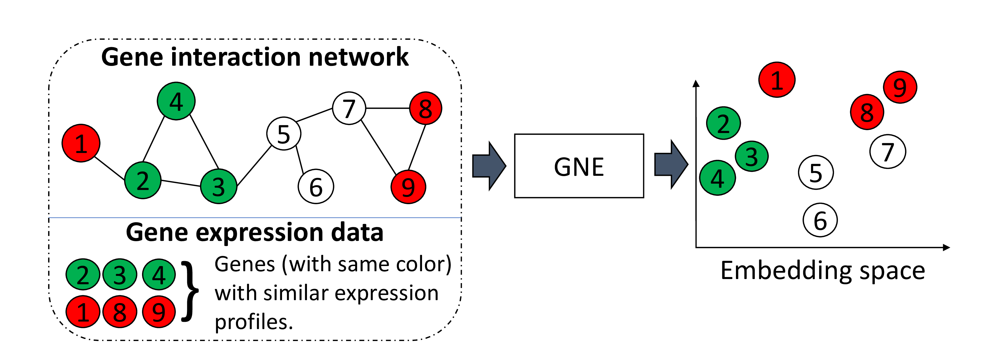
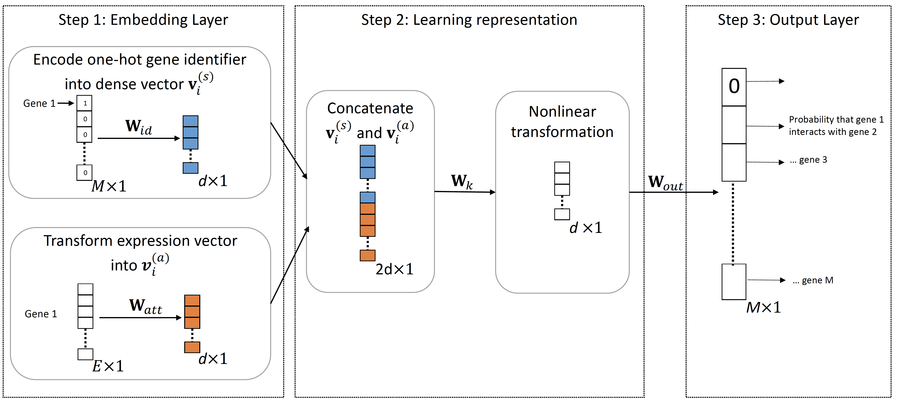

# GNE: A deep learning framework for gene network inference by aggregating biological information
This is the tensorflow implementation of the GNE as described in our paper.



GNE integrates gene interaction network with gene expression data to learn a more informative representations for gene network, which can be plugged into off-the-shelf machine learning methods for diverse functional inference tasks: gene function prediction, gene ontology reconstruction, and genetic interaction prediction. 

## Architecture of GNE


Requirements 
* TensorFlow (1.0 or later)
* python3.6
* sklearn
* networkx
* scipy

### Example to run demo.
```
python run_GNE.py
```

## Data

In order to use your own data, you have to provide

* an edgelist representing the interaction network which is converted to M by M adjacency matrix, and
* an M by E feature matrix (E is the number of experiments to measure gene expression)

We load interaction network data and expression data matrix for yeast in run_GNE.py as an example. The original datasets can be found from data sources:

| Dataset        | Source           | 
| ------------- |:-------------:|
| Interaction dataset  | [BioGRID](http://thebiogrid.org/) | 
| Gene expression data     | [DREAM5 Challenge](http://dreamchallenges.org/project/dream-5-network-inference-challenge/)    |  

You can use M by M adjacency matrix as input by editing run_GNE.py.

Note: the order of genes in adjacency matrix and feature matrix should be same.

## Settings
You can choose between the following settings:

* GNE: Setting λ = 0, GNE learns from only topological properties
* GNE+: Setting λ = 1, GNE learns from integration of topological properties and expression data

For coding, We name λ as alpha in parameters list. 

## Supplementary Materials
[Supplementary Table S1](https://github.com/kckishan/GNE_results/tree/master/Results/Supplementary Table S1.xlsx)  
[Supplementary Table S2](https://github.com/kckishan/GNE_results/tree/master/Results/Supplementary Table S2.xlsx)

For more details, visit [GNE references](GNE_details.md).
## Contact
kk3671@rit.edu
